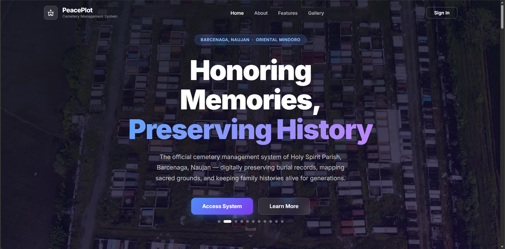
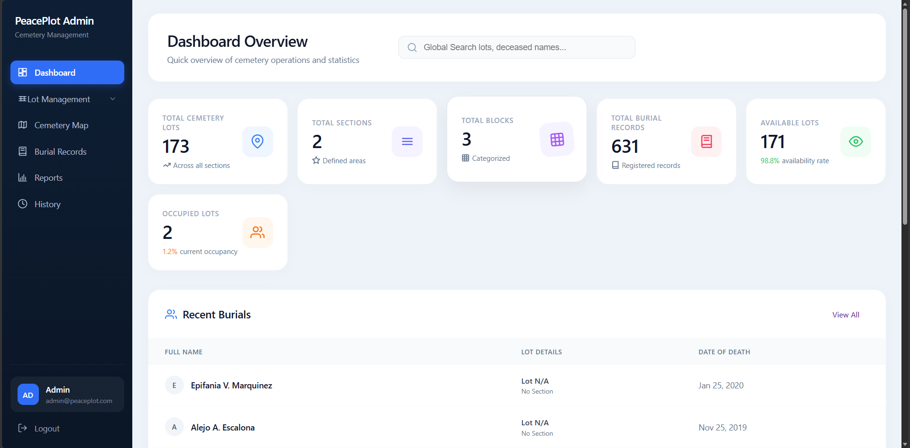

<div align="center">



<br/><br/>

# ⛪ PeacePlot
### Cemetery Management System

**Barcenaga Holy Spirit Parish** — Digital cemetery records, lot management, and burial tracking.

[](#license)
[](https://php.net)
[](https://sqlite.org)

</div>

---

<div align="center">



</div>

---

## Overview

PeacePlot is a web-based cemetery management system built for **Barcenaga Holy Spirit Parish**. It provides a complete digital solution for managing cemetery lots, burial records, and administrative operations — replacing manual paper-based processes with a clean, modern interface.

---

## Features

- **Cemetery Map** — Interactive visual map with lot markers showing section, block, and occupancy status
- **Burial Records** — Full CRUD for deceased records with archiving, restore, and image attachments
- **Lot Management** — Manage cemetery lots with multi-layer burial support
- **Block & Section Management** — Organize lots into blocks and sections with map coordinates
- **Reports** — Printable reports for lots, sections, blocks, and burial records with advanced filtering
- **System History** — Full audit trail tracking all user actions, logins, page visits, and data changes
- **User Management** — Admin can add, edit, delete staff accounts and approve password reset requests
- **Settings Security** — Identity verification gate before accessing system settings

---

## Tech Stack

| Layer | Technology |
|---|---|
| Backend | PHP 8.x |
| Database | SQLite (via PDO) |
| Frontend | Vanilla JS, HTML5, CSS3 |
| Server | Apache (WAMP/XAMPP) |

---

## Getting Started

**Requirements:** PHP 8.x, Apache, SQLite PDO extension enabled

```bash
# 1. Clone or copy to your web server directory
#    e.g. C:/wamp64/www/peaceplot

# 2. Initialize the database
# Open in browser:
http://localhost/peaceplot/database/web_init.php

# 3. Access the system
http://localhost/peaceplot/
```

Default admin credentials are set during database initialization.

---

## Project Structure

```
peaceplot/
├── public/          # All page views (dashboard, map, records, reports...)
├── api/             # REST API endpoints
├── assets/          # CSS, JS, images
├── config/          # Database, auth, logger
├── database/        # SQLite DB file and schema
└── index.php        # Login / landing page
```

---

## License

Copyright © 2025 **Barcenaga Holy Spirit Parish**. All rights reserved.

This software is proprietary. Unauthorized copying, distribution, or modification is strictly prohibited. See [LICENSE](LICENSE) for full terms.
